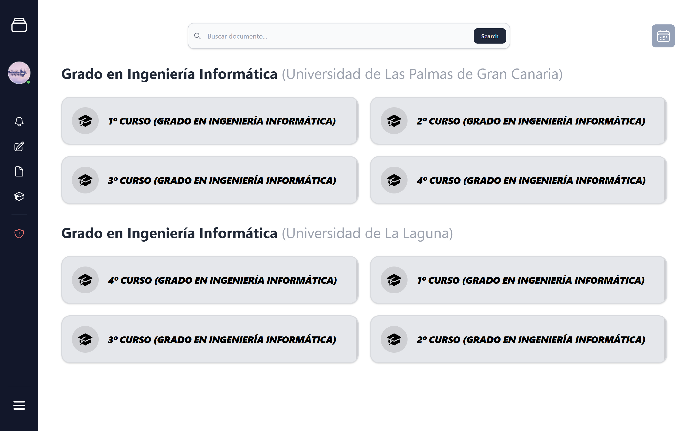

# EduTech – Sprint Uno

### Equipo _D-MACH_

### Marcial Galván - Houyame Liazidi - Alejandra Rodríguez - Cristina Santana - Dácil Santana



## Descripción del Proyecto

Este _sprint_ tiene como objetivo ampliar con el **minimo viable** (_MVP_) desarrollado en el _Sprint Zero_ de EduTech.

EduTech es una web que nace para resolver los siguientes problemas:

- **Dispersión del contenido académico**: Mantendremos el contenido organizado por cursos, asignaturas y cuatrimestres, facilitando la búsqueda del mismo.
- **Obsolescencia de material de estudio**: Se podrá reportar aquel contenido obsoleto o erróneo para que sea eliminado. De esta forma, se mantendrá un estándar mínimo de calidad y material actualizado.
- **Sobrecarga de información**: Se permitirá el filtrado del material por asignatura, título y tipo. Gracias a esto, los estudiantes podrán localizar el contenido de forma más eficiente.

---

## _Sprint Uno_

### Objetivos

El objetivo principal de este _sprint_ es ampliar el _MVP_ ya existente, incorporando las siguientes funcionalidades:

- Creación de cuestionarios y _flashcards_.
- Interacción con un _chatbot_ capaz de responder preguntas y generar contenido en base a los materiales subidos.
- Sistema de reportes como mecanismo de moderación.
- Estructura básica para organizar sesiones de estudio, lista para ser ampliada en _sprints_ posteriores.

Tras la implementación de este _sprint_, el _MVP_ ha evolucionado desde un simple repositorio de contenido hacia una
plataforma de estudio activa, que combina material académico, inteligencia artificial y funcionalidades básicas 
de colaboración entre estudiantes.

### Funcionalidades Incluidas

Durante este _sprint_ se han implementado las siguientes funcionalidades:

**Creación y Gestión de Recursos de Estudio**

- Elaboración y publicación de cuestionarios y _flashcards_
- Sección de borradores de contenido para cuestionarios y _flashcards_
- Gestión de contenido propio y suscripciones

**Inteligencia Artificial**

- Consultas al _chatbot_ sobre una asignatura
- Generación de apuntes y esquemas

**Moderación**

- Reportes de contenido y comentarios
- Creación del rol de administrador y revisión de reportes
- Eliminación de contenido inadecuado

**Estudio colaborativo**

- Estructura de sesiones de estudio lista para incorporar retransmisiones

**Ampliación del alcance**

- Expansión de la aplicación a otras universidades y titulaciones

> [!NOTE]
> Para ello, se han desarrollado las siguientes historias de usuario del _product backlog_:
>
> - **HT-000:** Investigación sobre vectorización de la Base de Datos
> - **HT-001:** Investigación de Modelos de IA
> - **HT-002:** Configuración de Hosting
> - **HT-003:** Investigación de Comunicación en Tiempo Real
> - **HU-106a:** Elaboración de Cuestionarios
> - **HU-106b:** Publicación de Cuestionarios
> - **HU-107:** Autoevaluación con Cuestionarios
> - **HU-108a:** Elaboración de _Flashcards_
> - **HU-108b:** Publicación de _Flashcards_
> - **HU-117:** Eliminar Contenido Propio
> - **HU-123:** Expansión a Otras Universidades y Titulaciones
> - **HU-124:** Gestionar Borradores de Contenido
> - **HU-125:** Mis Asignaturas
> - **HU-126:** Mi Perfil
> - **HU-201:** Consultas al _Chatbot_ sobre una Asignatura
> - **HU-202:** Generación de Apuntes y Esquemas por IA
> - **HU-301:** Creación de Anuncios para Sesión de Estudio
> - **HU-302:** Visualización de Próximas Sesiones de Estudio
> - **HU-400:** Reportar Contenido
> - **HU-401:** Revisar Reportes de Contenido
> - **HU-402:** Notificación al Creador por Contenido Eliminado
> - **HU-403:** Reportar Comentario Inadecuado

---

## Estructura del Proyecto

```bash
edutech/
├── frontend/                # Aplicación frontend (React + Vite)
│   └── src/
│       ├── components/      # Componentes reutilizables
│       ├── pages/           # Vistas principales
│       ├── services/        # Lógica de API
│       └── ...
├── backend/                 # Lógica de backend (Django)
└── tests/
    ├── frontend/            # Mock server (db.json)
    └── backend/
        ├── unit/            # Tests de unidad del backend
        ├── integration/     # Tests de integración de las entidades del backend
        └── bdd/             # Tests de comportamiento (BDD + Gherkin) del backend
```

- [`components/`](edutech/frontend/src/components/): Elementos reutilizados a lo largo de toda la aplicación (y con posibilidad de reutilizarlos en el futuro).

- [`pages/`](edutech/frontend/src/pages): Vistas principales, a las que el usuario puede acceder y navegar.

- [`services/`](edutech/frontend/src/services): Interfaz entre el backend y los componentes del _frontend_.

> [!TIP]
> _Para más información acerca de la implementación realizada, pueden consultar la documentación
> específica de [componentes](doc/sprint-1/Components.md), [páginas](doc/sprint-1/Pages.md) y [servicios](doc/sprint-1/Services.md)_

---

## Integración Continua y Calidad del Código

El proyecto cuenta con un _pipeline_ de **CI/CD** configurado en [GitHub Actions](../../.github/workflows/ci.yml) que se ejecuta automáticamente con cada _push_ a las ramas `main` y `develop`.
<br>
Los tests incluidos en este _pipeline_ han sido ampliados tras añadir nuevas funcionalidades en este nuevo _sprint_.

### Pasos del pipeline

**Análisis estático**

- Comprobación de formato con `ruff format`
- _Linting_ con `ruff check`
- Verificación de tipos estáticos con `mypy`

**Tests del backend**

- **Tests de unidad** — verifican el comportamiento individual de cada componente
- **Tests de integración** — comprueban la interacción entre las distintas entidades del backend
- **Tests BDD** — validan los flujos de usuario mediante escenarios escritos en _Gherkin_

> [!NOTE]
> El backend cuenta con cobertura de tests de estos tres tipos. Los tests se encuentran en [`tests/backend/`](edutech/tests/backend/), organizados en las carpetas `unit/`, `integration/` y `bdd/`.

---

## Próximos pasos

En el siguiente y último _sprint_ se buscará evolucionar el _Minimum Viable Product_ implementado,
añadiendo funcionalidades como:

- Mejora del perfil de usuario, incluyendo un espacio personal que permite guardar contenido y organizarlo en carpetas.
- Incorporación de la generación automática de cuestionarios y _flashcards_ mediante IA.
- Sistema de revisión de contenido con IA, antes de su publicación, como medida de seguridad.
- Implementación de sesiones de estudio colaborativas con retransmisiones en tiempo real.

---

## Ejecución del proyecto

Estos son los comandos a ejecutar para lanzar el proyecto. Nótese que cada serie
de comandos ha sido ejecutada desde la carpeta `Edutech/`.

1. Instalar dependencias:

```bash
# En frontend
cd edutech/frontend
npm install
npm install react-router-dom react react-dom
```

```bash
# En backend
cd ..
pip install -r ./backend/requirements.txt
```

2. Lanzar los distintos componentes de la aplicación

- Base de datos

```bash
cd backend
docker compose up
```

- Backend

```bash
cd edutech/
python backend/manage.py migrate
python backend/manage.py runserver
```

- Frontend

```bash
cd edutech/frontend
npm run dev
```

---

## Tech Stack

<div>
  
  
  
  
  
  
  
  
  
  
  
  
</div>
