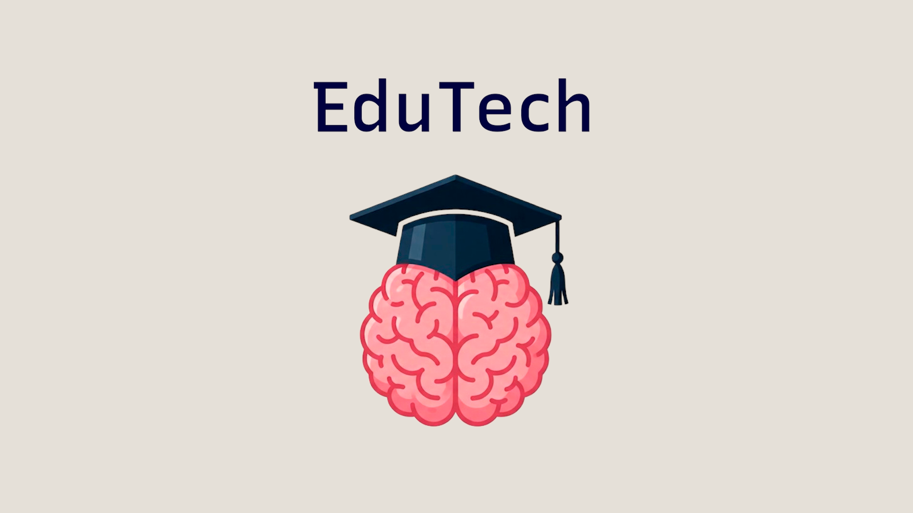

# EduTech

### Equipo _D-MACH_ — Marcial Galván - Houyame Liazidi - Alejandra Rodríguez - Cristina Santana - Dácil Santana

<div align="left">
      <a href="https://www.youtube.com/watch?v=TSjU3uns65I">
        
     </a>
</div>
<sub><em><a href="https://www.youtube.com/watch?v=TSjU3uns65I">Acceder a la presentación en YouTube ↑</a></em></sub>
<br></br>

> **Tu carrera, organizada. Tus apuntes, centralizados. Tus dudas, resueltas. EduTech es la plataforma académica que necesitas para optimizar tu aprendizaje.**

---

## Los 3 Pilares de **_EduTech_**

### I. Repositorio Académico
Centraliza y organiza el contenido de tu carrera.

* **Estructura Adaptativa:** Material categorizado por *Titulación ➔ Curso ➔ Asignatura ➔ Cuatrimestre*.
* **Variedad de Contenido:** Consulta PDFs, vídeos de YouTube, cuestionarios y *flashcards*.
* **Mi Espacio:** Guarda documentos importantes y organízalos en tu espacio personal.

### II. Asistente de Estudio IA
Cada asignatura cuenta con un **_Chatbot Contextual_** que responde en base al material contenido en ella. Incluye un modo de _Pensamiento Profundo_ para analizar elementos visuales complejos.

| Modo de IA | Función | Caso de uso |
| :--- | :--- | :--- |
| **Estricto** | Se ciñe al 100% al contenido de la asignatura. | Repasar datos exactos para el examen. |
| **Tutor** | Explica conceptos complejos de forma simple. | Entender conceptos, solventar dudas. |
| **Ejercicios** | Genera problemas y ejercicios prácticos. | Practicar ejercicios similares a los de clase. |
| **Esquemas** | Crea resúmenes estructurados. | Estructurar el contenido estudiado. |

> [!TIP]
> Para autoevaluarte tras tu estudio, solicita al _chatbot_ que genere cuestionarios y *flashcards* en base a los apuntes subidos.

### III. Colaboración y Moderación
Un entorno colaborativo y de calidad.

* **Interacción con el Contenido:** Sistema de valoración con *likes* y comentarios.
* **Estudio Colaborativo:** Vincula tu cuenta de **Twitch** y emite sesiones de estudio en directo integradas en la plataforma.
* **Moderación:** Los administradores revisarán contenido inapropiado, detectado por la IA o reportado por los usuarios.
---

## Ciclo de Desarrollo - Sprints

El proyecto se ha desarrollado siguiendo la metodología _Scrum_, en una serie de _sprints_ de aproximadamente 2 semanas cada uno. Se puede consultar la documentación técnica de cada _sprint_ a continuación:

| Sprint | Enfoque Principal | Documentación Técnica |
| :---: | :--- | :--- |
| **Sprint 0** | Arquitectura base y repositorio estructurado por asignaturas. | [Doc Técnica - Sprint 0](./doc/sprint-0/) |
| **Sprint 1** | Integración del pipeline de IA, creación de material de estudio. | [Doc Técnica - Sprint 1](./doc/sprint-1/) |
| **Sprint 2** | Espacio personal, integración de API de Twitch y mejoras en la IA. | [Doc Técnica - Sprint 2](./doc/sprint-2/) |

---

## Ejecución del proyecto

Estos son los comandos a ejecutar para lanzar el proyecto. Nótese que cada serie de comandos ha sido ejecutada desde la carpeta `Edutech/`.

1. Instalar dependencias:

```bash
# En frontend
cd edutech/frontend
npm install
npm install react-router-dom react react-dom
```

```bash
# En backend
cd ..
pip install -r ./backend/requirements.txt
```

2. Lanzar la aplicación


```bash
cd edutech/
python backend/manage.py migrate
docker compose -f docker-compose.local-yml up
```

---

## Tech Stack

<p align="center">
  
  
  
  
  
  
  
  
  
  
  
  
  
  
  
        
</p>
