# Componentes

---

## Navegación y Layout
| Componente                                                    | Descripción                                                                    | Imagen                                            |
|---------------------------------------------------------------|--------------------------------------------------------------------------------|---------------------------------------------------|
| [PostCard](../edutech/frontend/src/components/PostCard.jsx)   | Representa un recurso individual (PDF o vídeo) mostrando su información básica |    |
| [PostGrid](../edutech/frontend/src/components/PostGrid.jsx)   | Layout que organiza múltiples recursos en formato responsive                   | 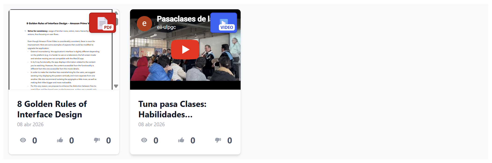   |
| [TitlePage](../edutech/frontend/src/components/TitlePage.jsx) | Cabecera de página con navegación y botón de retorno                           | 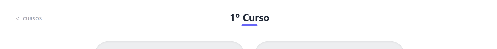 |

## Navegación y Layout
| Componente                                                                | Descripción                                               | Imagen                                            |
|---------------------------------------------------------------------------|-----------------------------------------------------------|---------------------------------------------------|
| [Layout](../edutech/frontend/src/components/Layout.jsx)                   | Estructura principal de la aplicación con header y footer | 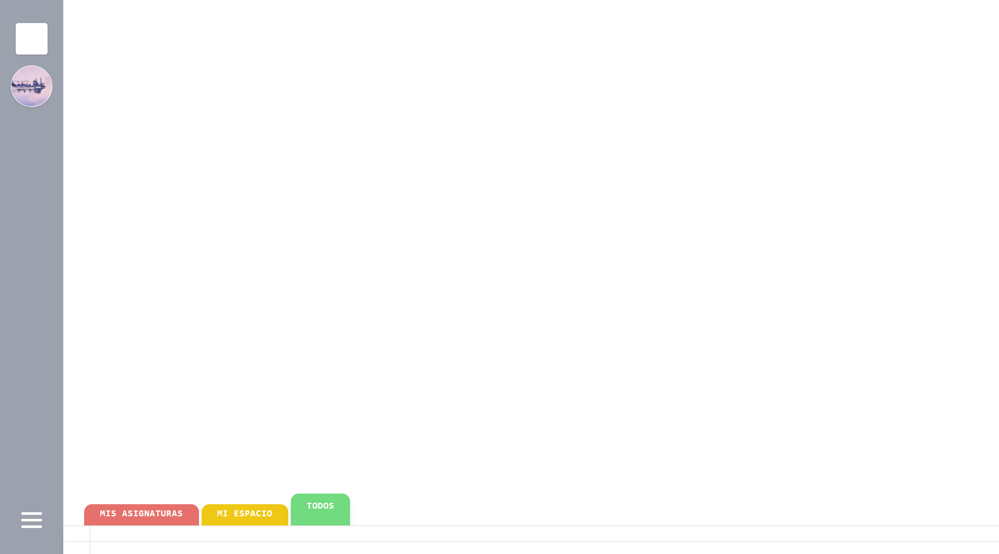       |
| [Header](../edutech/frontend/src/components/Header.jsx)                   | Barra lateral con navegación y perfil de usuario          |        |
| [Footer](../edutech/frontend/src/components/Footer.jsx)                   | Navegación inferior con pestañas dinámicas                | 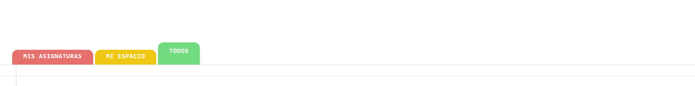       |
| [HamburgerButton](../edutech/frontend/src/components/HamburgerButton.jsx) | Botón para expandir/contraer el menú lateral              |  |

## Cursos y Asignaturas
| Componente                                                      | Descripción                                                 | Imagen                                                    |
|-----------------------------------------------------------------|-------------------------------------------------------------|-----------------------------------------------------------|
| [WidgetCourse](../edutech/frontend/src/components/Course.jsx)   | Tarjeta visual para representar cursos                      | 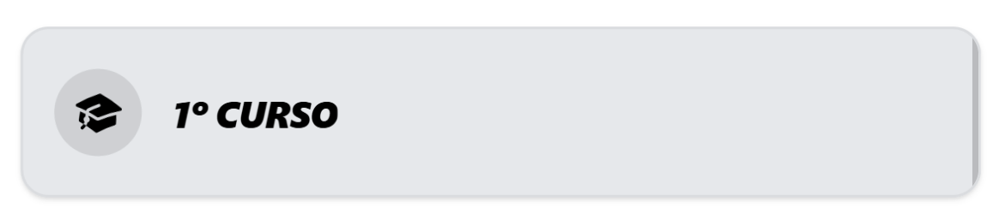   |
| [WidgetSubject](../edutech/frontend/src/components/Subject.jsx) | Tarjeta de asignatura con opción de suscripción             | 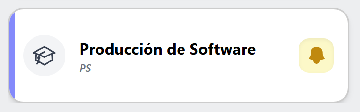 |
| [Quarter](../edutech/frontend/src/components/Quarter.jsx)       | Contenedor de asignaturas por cuatrimestre                  |              |
| [BellButton](../edutech/frontend/src/components/BellButton.jsx) | Botón de suscripción/anulación de suscripción a asignaturas |        |

## Interacción y Feedback
| Componente                                                                      | Descripción                          | Imagen                                                            |
|---------------------------------------------------------------------------------|--------------------------------------|-------------------------------------------------------------------|
| [ReactionButton](../edutech/frontend/src/components/ReactionButton.jsx)         | Botón de like o dislike              | 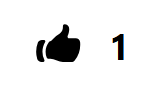       |
| [ReactionsContainer](../edutech/frontend/src/components/ReactionsContainer.jsx) | Contenedor de botones like y dislike |  |
| [Views](../edutech/frontend/src/components/Views.jsx)                           | Contador de visualizaciones          |                          |
| [Comentario](../edutech/frontend/src/components/Comentario.jsx)                 | Representación de un comentario      | 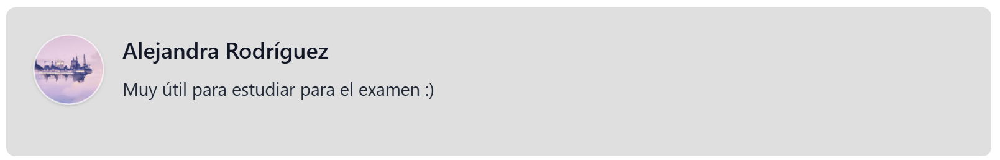               |
| [PopUp](../edutech/frontend/src/components/PopUp.jsx)                           | Modal para añadir comentarios        |                          |

## Formularios y Entrada de Datos
| Componente                                                    | Descripción                                     | Imagen                                            |
|---------------------------------------------------------------|-------------------------------------------------|---------------------------------------------------|
| [Input](../edutech/frontend/src/components/Input.jsx)         | Campo personalizado para la entrada de datos    | 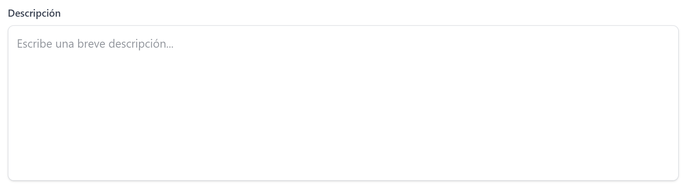         |
| [SearchBar](../edutech/frontend/src/components/SearchBar.jsx) | Barra de búsqueda de contenido                  |  |
| [Tabs](../edutech/frontend/src/components/Tabs.jsx)           | Filtro de tipos de contenido (PDF, vídeo, etc.) |            |

## Visualización de Contenido
| Componente                                                      | Descripción                              | Imagen                                              |
|-----------------------------------------------------------------|------------------------------------------|-----------------------------------------------------|
| [VisorPDF](../edutech/frontend/src/components/VisorPDF.jsx)     | Visualizador embebido de documentos PDF  | 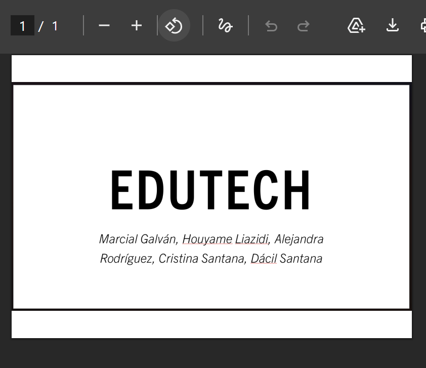     |
| [VisorVideo](../edutech/frontend/src/components/VisorVideo.jsx) | Reproductor de vídeos (YouTube embed)    | 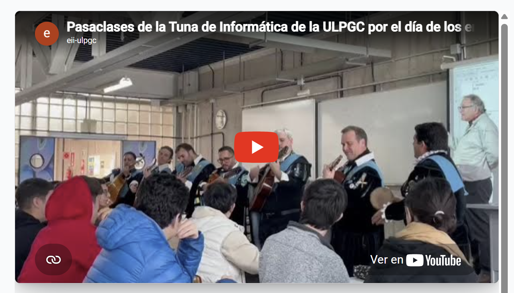 |
| [Descargar](../edutech/frontend/src/components/Descargar.jsx)   | Botón/elemento para descarga de recursos |    |

## Usuario
| Componente                                                      | Descripción                               | Imagen                                              |
|-----------------------------------------------------------------|-------------------------------------------|-----------------------------------------------------|
| [UserAvatar](../edutech/frontend/src/components/UserAvatar.jsx) | Avatar del usuario (imagen o placeholder) |  |