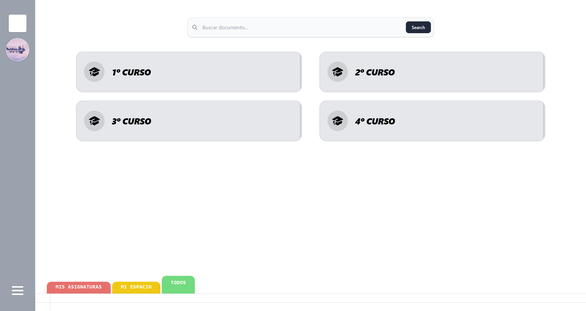

# EduTech – Sprint Zero

### Equipo _D-MACH_

### Marcial Galván - Houyame Liazidi - Alejandra Rodríguez - Cristina Santana - Dácil Santana



## Descripción del Proyecto

Este _sprint_ inicial tiene como objetivo construir el **primer minimo viable** (_MVP_) de EduTech.

EduTech es una web que nace para resolver los siguientes problemas:

- **Dispersión del contenido académico**: Mantendremos el contenido organizado por cursos, asignaturas y cuatrimestres, facilitando la búsqueda del mismo.
- **Obsolescencia de material de estudio**: Se podrá reportar aquel contenido obsoleto o erróneo para que sea eliminado. De esta forma, se mantendrá un estándar mínimo de calidad y material actualizado.
- **Sobrecarga de información**: Se permitirá el filtrado del material por asignatura, título y tipo. Gracias a esto, los estudiantes podrán localizar el contenido de forma más eficiente.

---

## _Sprint Zero_

### Objetivos

El objetivo principal de este primer _sprint_ es otorgar valor al usuario, mediante disponer una aplicación que permita:

- Centralizar el contenido académico, organizado por cursos y asignaturas.
- Subir y visualizar contenido, como documentos PDF y vídeos.
- Interactuar con los recursos subidos, mediante valoraciones, comentarios y suscripciones.

### Funcionalidades Incluidas

Durante este sprint se han implementado las siguientes funcionalidades:

**Gestión de contenido**

- Subida de documentos PDF y vídeos (enlace a YouTube)
- Visualización y descarga de materiales
- Búsqueda de material por asignatura, título y tipo

**Navegación**

- Organización por cursos y asignaturas
- Filtrado de contenido

**Interacción**

- Valoración de documentos y vídeos (likes / dislikes)
- Contadores de visualización

**Suscripciones**

- Suscripción a asignaturas
- Notificaciones (correo electrónico) al cambiar de contenido una asignatura sobre la que existe una suscripción.

> [!NOTE]
> Para ello, se han desarrollado las siguientes historias de usuario del _product backlog_:
>
> - **HU-000:** Inicio de sesión
> - **HU-100:** Subida de Documentos a Asignaturas
> - **HU-101:** Visualización de Material de Asignatura
> - **HU-102:** Navegación Organizada por Cursos
> - **HU-109:** Publicación de vídeos
> - **HU-110:** Descarga de contenido para uso offline
> - **HU-112:** Búsqueda de documentos por título
> - **HU-116:** Filtrado de Material por Asignatura
> - **HU-118:** Sistema de comentarios
> - **HU-119:** Visualización de comentarios
> - **HU-120 / HU-121:** Valoración de contenido
> - **HU-122:** Contadores de valoración
> - **HU-103 / HU-104 / HU-105:** Sistema de suscripciones

---

## Estructura del Proyecto

```bash
edutech/
├── frontend/                # Aplicación frontend (React + Vite)
│   └── src/
│       ├── components/      # Componentes reutilizables
│       ├── pages/           # Vistas principales
│       ├── services/        # Lógica de API
│       └── ...
├── backend/                 # Lógica de backend (Django)
└── tests/
    ├── frontend/            # Mock server (db.json)
    └── backend/
        ├── unit/            # Tests de unidad del backend
        ├── integration/     # Tests de integración de las entidades del backend
        └── bdd/             # Tests de comportamiento (BDD + Gherkin) del backend
```

- [`components/`](../../edutech/frontend/src/components/): Elementos reutilizados a lo largo de toda la aplicación (y con posibilidad de reutilizarlos en el futuro).

- [`pages/`](../../edutech/frontend/src/pages): Vistas principales, a las que el usuario puede acceder y navegar.

- [`services/`](../../edutech/frontend/src/services): Interfaz entre el backend y los componentes del _frontend_.

> [!TIP]
> _Para más información acerca de la implementación realizada, pueden consultar la documentación
> específica de [componentes](./Components.md), [páginas](./Pages.md) y [servicios](./Services.md)_

---

## Integración Continua y Calidad del Código

El proyecto cuenta con un pipeline de **CI/CD** configurado en [GitHub Actions](../../.github/workflows/ci.yml) que se ejecuta automáticamente con cada _push_ a las ramas `main` y `develop`.

### Pasos del pipeline

**Análisis estático**

- Comprobación de formato con `ruff format`
- _Linting_ con `ruff check`
- Verificación de tipos estáticos con `mypy`

**Tests del backend**

- **Tests de unidad** — verifican el comportamiento individual de cada componente
- **Tests de integración** — comprueban la interacción entre las distintas entidades del backend
- **Tests BDD** — validan los flujos de usuario mediante escenarios escritos en _Gherkin_

> [!NOTE]
> El backend cuenta con cobertura de tests de estos tres tipos. Los tests se encuentran en [`tests/backend/`](../../edutech/tests/backend/), organizados en las carpetas `unit/`, `integration/` y `bdd/`.

---

## Próximos pasos

En el siguiente _sprint_ se buscará evolucionar el _Minimum Viable Product_ implementado,
añadiendo funcionalidades como:

- Integración de un chatbot basado en IA, capaz de responder a preguntas y generar material en base al contenido subido.
- Creación y publicación de material de estudio, como cuestionarios y _flashcards_.
- Sistema de reporte de material y comentarios.
- Organización de sesiones de estudio en una fecha y hora determinadas.

---

## Ejecución del proyecto

Estos son los comandos a ejecutar para lanzar el proyecto. Nótese que cada serie
de comandos ha sido ejecutada desde la carpeta `Edutech/`.

1. Instalar dependencias:

```bash
# En frontend
cd edutech/frontend
npm install
npm install react-router-dom react react-dom
```

```bash
# En backend
cd ..
pip install -r ./backend/requirements.txt
```

2. Lanzar los distintos componentes de la aplicación

- Base de datos

```bash
cd backend
docker compose up
```

- Backend

```bash
cd edutech/
python backend/manage.py migrate
python backend/manage.py runserver
```

- Frontend

```bash
cd edutech/frontend
npm run dev
```

---

## Tech Stack

<div>
  
  
  
  
  
  
  
  
  
  
  
  
</div>
