# Componentes

A continuación, se detallan todas los componentes implementados en el desarrollo de esta aplicación.

---

## Navegación y Layout

| Componente | Descripción | Imagen |
| --- | --- | --- |
| [Layout](../../edutech/frontend/src/components/Layout.tsx) | Estructura principal de la aplicación que envuelve el contenido con el header |  |
| [Header](../../edutech/frontend/src/components/Header.tsx) | Barra lateral de navegación con acceso al perfil y secciones principales | 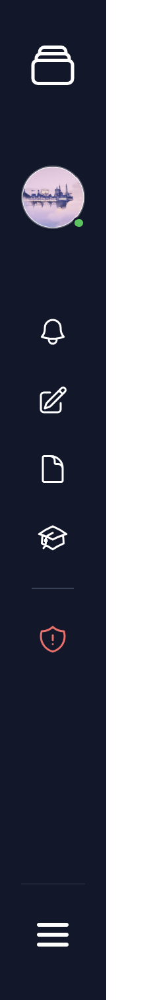 |
| [HamburgerButton](../../edutech/frontend/src/components/HamburgerButton.tsx) | Botón para expandir o contraer el header |  |
| [TitlePage](../../edutech/frontend/src/components/TitlePage.tsx) | Cabecera de página con título y botón de retorno |  |

## Contenido

| Componente | Descripción | Imagen |
| --- | --- | --- |
| [PostCard](../../edutech/frontend/src/components/PostCard.tsx) | Tarjeta que representa un recurso individual mostrando su información básica | 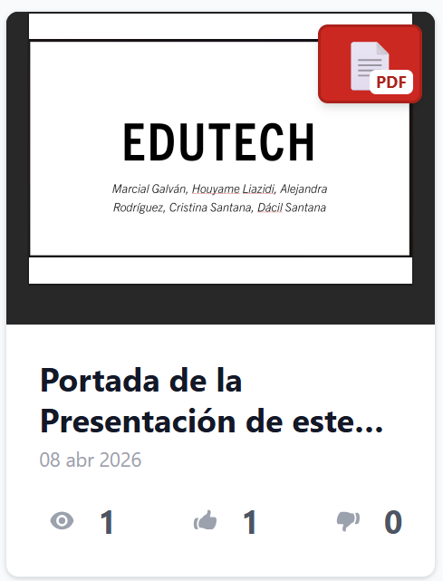 |
| [PostGrid](../../edutech/frontend/src/components/PostGrid.tsx) | Layout que organiza múltiples tarjetas de recursos en formato responsive |  |

## Cursos y Asignaturas

| Componente | Descripción | Imagen |
| --- | --- | --- |
| [YearWidget](../../edutech/frontend/src/components/YearWidget.tsx) | Widget que representa a un año académico | 
| [CourseWidget](../../edutech/frontend/src/components/CourseWidget.tsx) | Widget que representa a una asignatura y la suscripción asociada a ella |  |
| [Quarter](../../edutech/frontend/src/components/Quarter.tsx) | Contenedor de asignaturas pertenecientes a un mismo cuatrimestre | 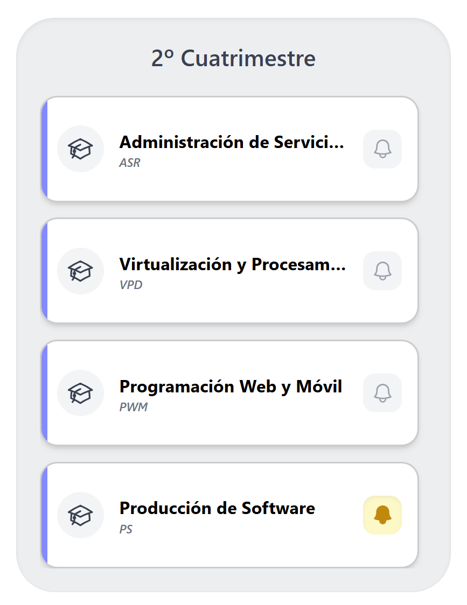 |
| [BellButton](../../edutech/frontend/src/components/interactions/BellButton.tsx) | Botón de suscripción o anulación de suscripción a una asignatura |  |

## Interacción y Feedback

| Componente | Descripción | Imagen |
| --- | --- | --- |
| [ReactionButton](../../edutech/frontend/src/components/interactions/ReactionButton.tsx) | Botón individual de like o dislike sobre un recurso |  |
| [ReactionsContainer](../../edutech/frontend/src/components/interactions/ReactionsContainer.tsx) | Contenedor que agrupa los botones de like y dislike con sus contadores | 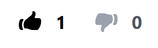 |
| [Views](../../edutech/frontend/src/components/interactions/Views.tsx) | Contador de visualizaciones de un recurso | 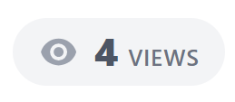 |
| [Comment](../../edutech/frontend/src/components/interactions/Comment.tsx) | Representación de un comentario con autor, fecha y contenido |  |
| [CommentModal](../../edutech/frontend/src/components/interactions/CommentModal.tsx) | Modal para añadir un nuevo comentario a un recurso | 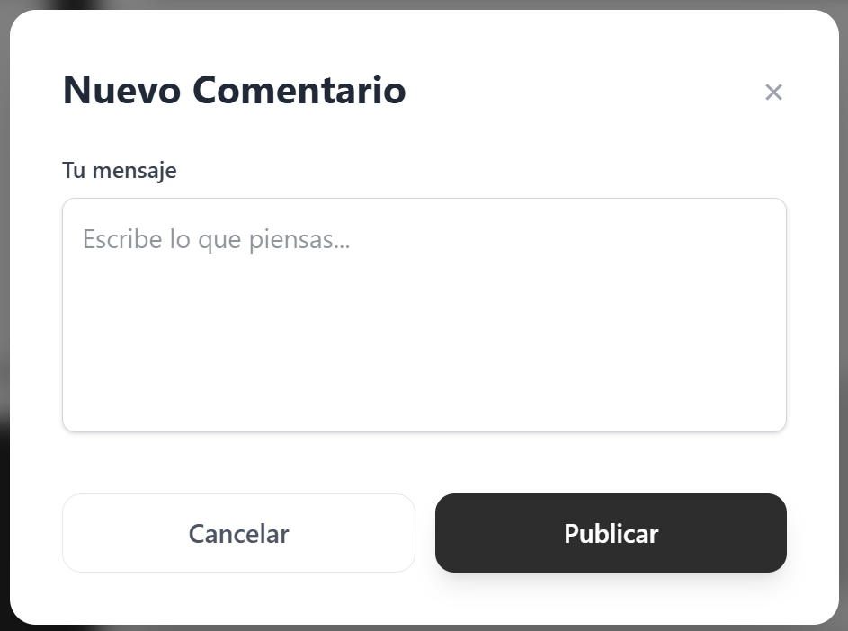 |
| [CommentsSection](../../edutech/frontend/src/components/interactions/CommentsSection.tsx) | Sección que lista todos los comentarios asociados a un recurso | 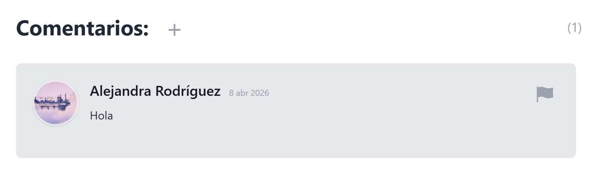 |

## Formularios y Entrada de Datos

| Componente | Descripción | Imagen |
| --- | --- | --- |
| [Input](../../edutech/frontend/src/components/Input.tsx) | Campo personalizado para la entrada de datos |  |
| [SearchBar](../../edutech/frontend/src/components/SearchBar.tsx) | Barra de búsqueda de contenido | 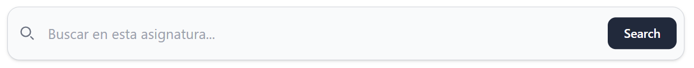 |
| [Tabs](../../edutech/frontend/src/components/Tabs.tsx) | Filtro por tipo de contenido (PDF, vídeo, flashcard, cuestionario) |  |
| [ValidatorInput](../../edutech/frontend/src/components/forms-components/ValidatorInput.tsx) | Input con validación integrada para formularios de publicación |  |

## Publicación de Contenido

| Componente | Descripción | Imagen |
| --- | --- | --- |
| [Footer](../../edutech/frontend/src/components/Footer.tsx) | Navegación inferior para publicar distintos tipos de material | 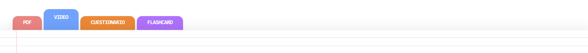 |
| [FormSteps](../../edutech/frontend/src/components/forms-components/FormSteps.tsx) | Estructura de formulario para publicar documentos PDF | 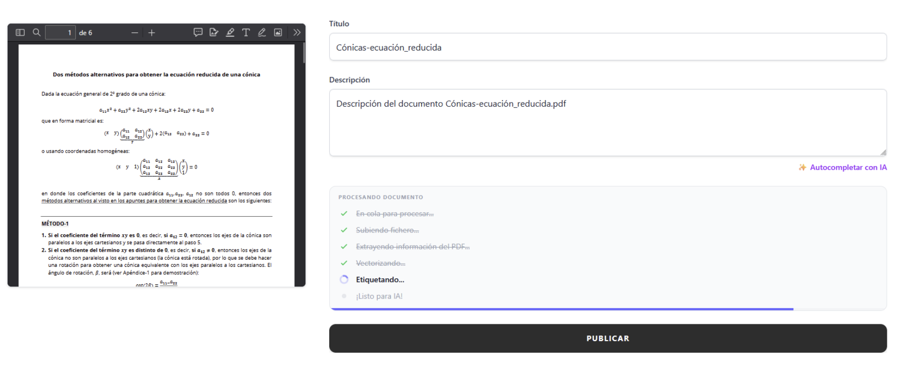 |
| [StageList](../../edutech/frontend/src/components/forms-components/StageList.tsx) | Listado de las etapas del formulario de publicación de PDF |  |
| [ProgressBar](../../edutech/frontend/src/components/forms-components/ProgressBar.tsx) | Barra de progreso para las tareas en la publicación de un PDF | 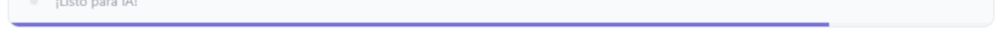 |
| [UploadDropzone](../../edutech/frontend/src/components/forms-components/UploadDropzone.tsx) | Zona para subir el archivo al publicar un documento PDF | 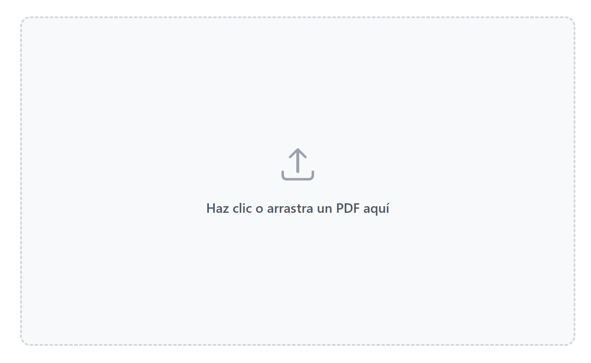 |
| [UploadUrl](../../edutech/frontend/src/components/forms-components/UploadUrl.tsx) | Campo para introducir la URL del vídeo a publicar | 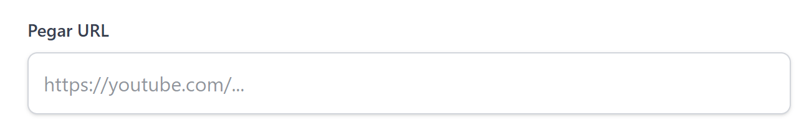 |
| [UrlPreview](../../edutech/frontend/src/components/forms-components/UrlPreview.tsx) | Vista previa del vídeo a partir de la URL introducida |  |
| [UploadImage](../../edutech/frontend/src/components/UploadImage.tsx) | Componente para seleccionar y previsualizar una imagen | 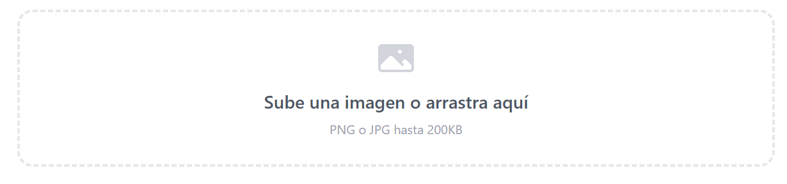 |
| [UploadMenuButton](../../edutech/frontend/src/components/UploadMenuButton.tsx) | Desplegable para seleccionar la publicación de un contenido |  |

## Visualización de Contenido

| Componente | Descripción | Imagen |
| --- | --- | --- |
| [PDFViewer](../../edutech/frontend/src/components/PDFViewer.tsx) | Visor de documentos PDF |  |
| [VideoViewer](../../edutech/frontend/src/components/VideoViewer.tsx) | Reproductor de vídeos (embed de YouTube) |  |
| [DownloadButton](../../edutech/frontend/src/components/DownloadButton.tsx) | Botón para descargar un documento PDF |  |
| [DocumentInfo](../../edutech/frontend/src/components/DocumentInfo.tsx) | Panel con la información de un documento PDF | 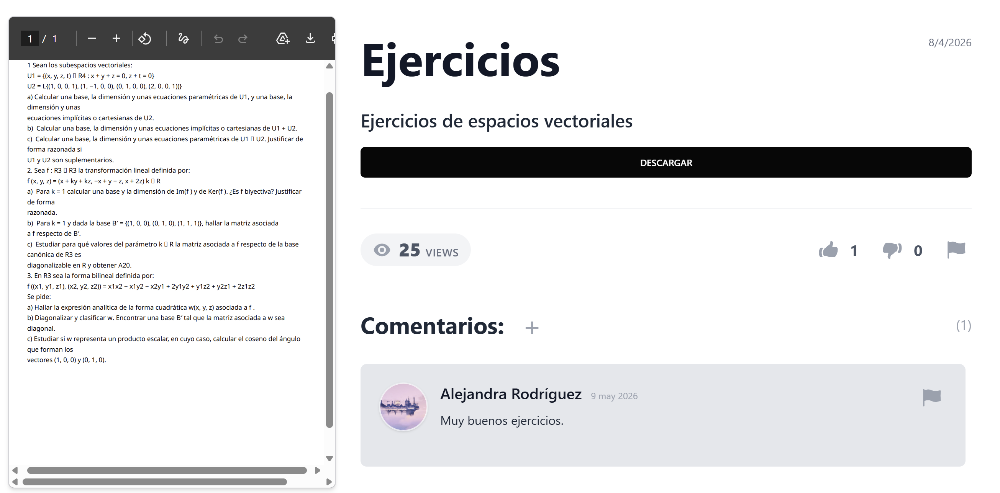 |

## Usuario

| Componente | Descripción | Imagen |
| --- | --- | --- |
| [UserAvatar](../../edutech/frontend/src/components/UserAvatar.tsx) | Avatar del usuario con su imagen de perfil o un placeholder por defecto | 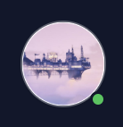 |

## Editor de Material de Estudio

| Componente | Descripción | Imagen |
| --- | --- | --- |
| [EditorLayout](../../edutech/frontend/src/components/study-material/EditorLayout.tsx) | Estructura principal del editor, gestiona el guardado automático y la navegación | 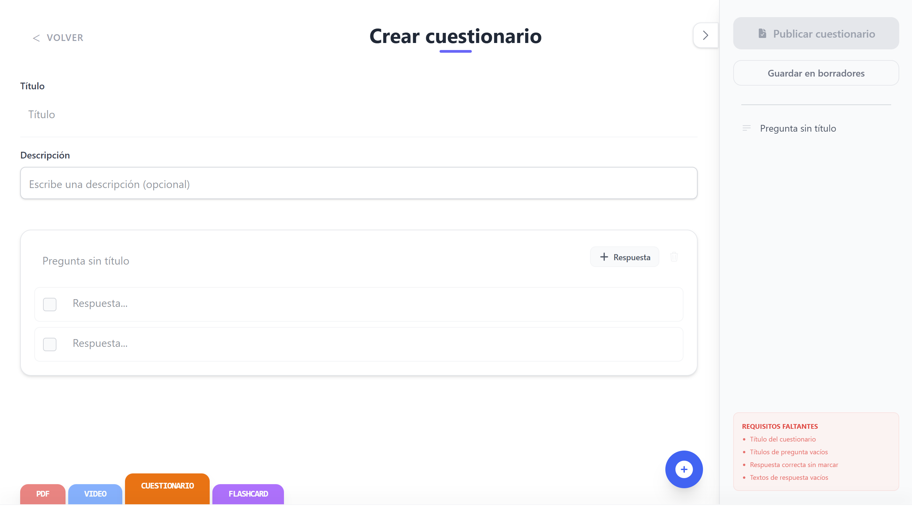 |
| [EditorHeader](../../edutech/frontend/src/components/study-material/EditorHeader.tsx) | Cabecera del editor con título editable y botones de guardar o publicar |  |
| [EditorSidebar](../../edutech/frontend/src/components/study-material/EditorSidebar.tsx) | Panel lateral del editor con el listado de _flashcards_ o preguntas creadas | 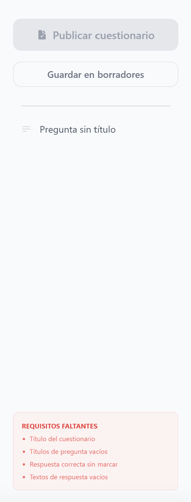 |
| [AddItemButton](../../edutech/frontend/src/components/study-material/AddItemButton.tsx) | Botón para añadir una nueva tarjeta o pregunta al formulario |  |
| [ConfirmModal](../../edutech/frontend/src/components/study-material/ConfirmModal.tsx) | Modal de confirmación para acciones destructivas | 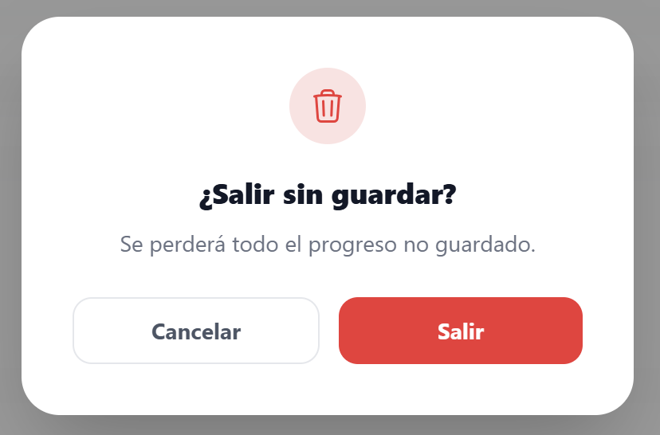 |

## Flashcards

| Componente | Descripción | Imagen |
| --- | --- | --- |
| [FlashCardView](../../edutech/frontend/src/components/study-material/flashcards/FlashCardView.tsx) | Vista principal del modo de estudio de flashcards |  |
| [FlashCardItem](../../edutech/frontend/src/components/study-material/flashcards/FlashCardItem.tsx) | Tarjeta individual con pregunta y respuesta | 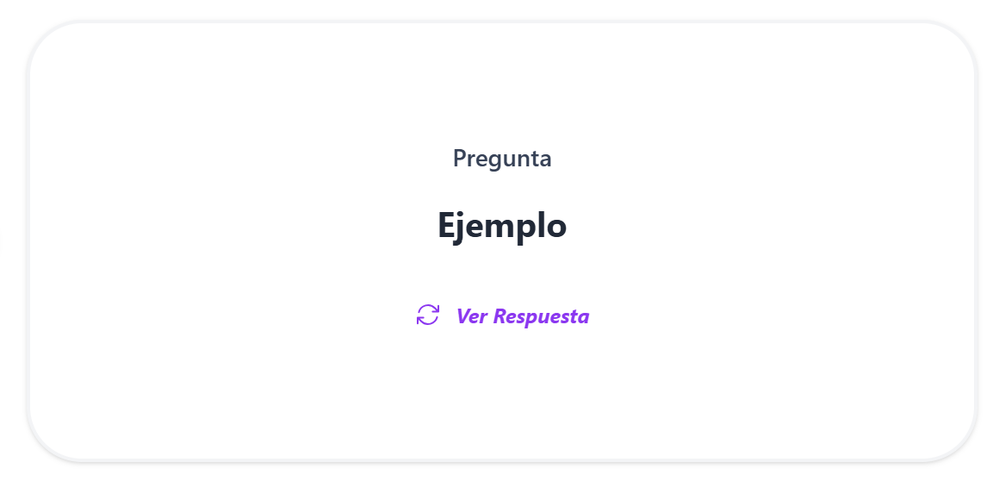 |
| [CardCarousel](../../edutech/frontend/src/components/study-material/flashcards/CardCarousel.tsx) | Carrusel para navegar entre las _flashcards_ del grupo |  |

## Cuestionarios

Componentes utilizados en el modo de realización de cuestionarios.

| Componente | Descripción | Imagen |
| --- | --- | --- |
| [QuizCard](../../edutech/frontend/src/components/study-material/quiz/QuizCard.tsx) | Pregunta del cuestionario con sus respuestas | 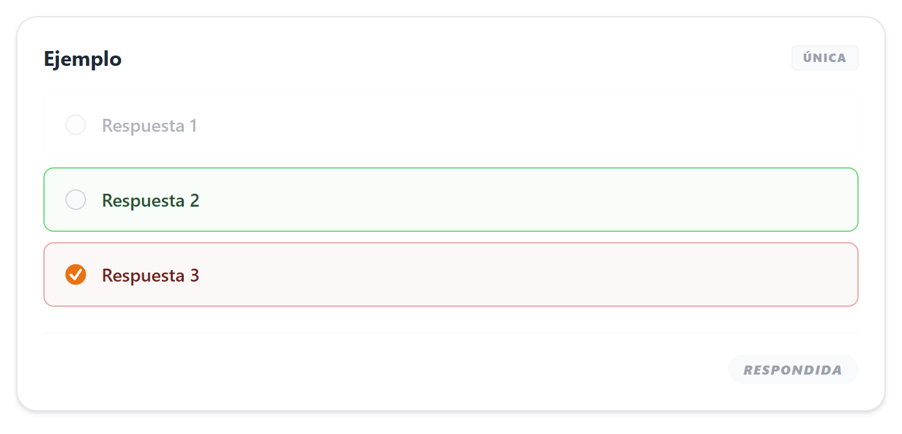 |
| [QuizQuestion](../../edutech/frontend/src/components/study-material/quiz/QuizQuestion.tsx) | Enunciado de una pregunta del cuestionario | 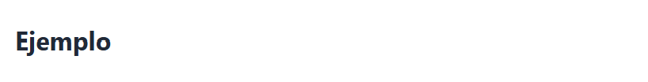 |
| [QuizAnswer](../../edutech/frontend/src/components/study-material/quiz/QuizAnswer.tsx) | Respuesta seleccionable con indicador de acierto o error |  |

## Estudio

| Componente | Descripción | Imagen |
| --- | --- | --- |
| [StudyHeader](../../edutech/frontend/src/components/study-material/StudyHeader.tsx) | Cabecera con botón de retorno y título |  |
| [StudyProgressBar](../../edutech/frontend/src/components/study-material/StudyProgressBar.tsx) | Barra de progreso que indica cuántas tarjetas se han completado | 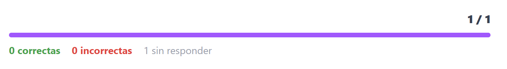 |
| [StudySidebar](../../edutech/frontend/src/components/study-material/StudySidebar.tsx) | Panel lateral con el índice de tarjetas o preguntas | 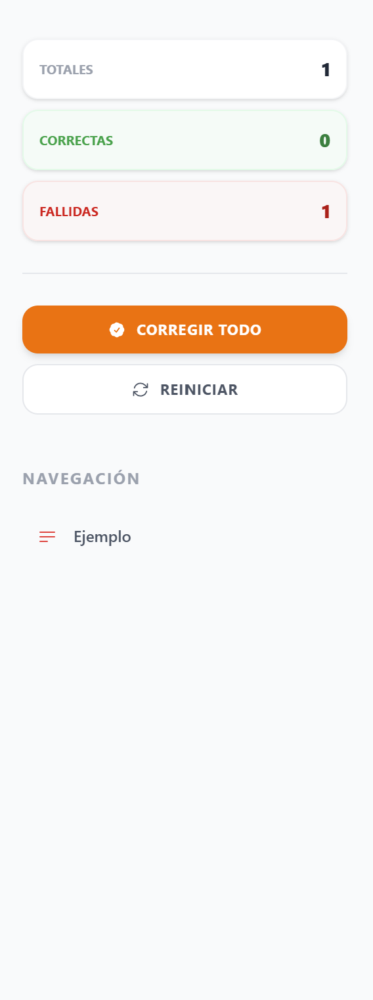 |
| [Stats](../../edutech/frontend/src/components/study-material/Stats.tsx) | Panel de resultados con el número de respuestas correctas e incorrectas | 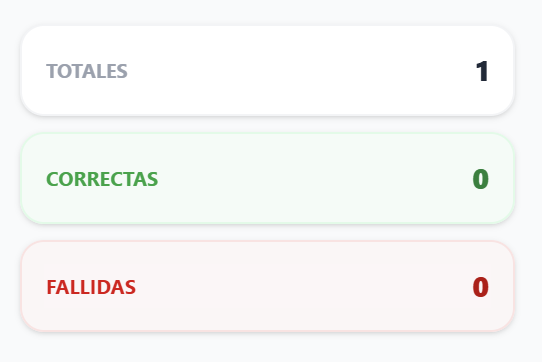 |
| [CompletionBanner](../../edutech/frontend/src/components/study-material/CompletionBanner.tsx) | Resumen del resultado del estudio | 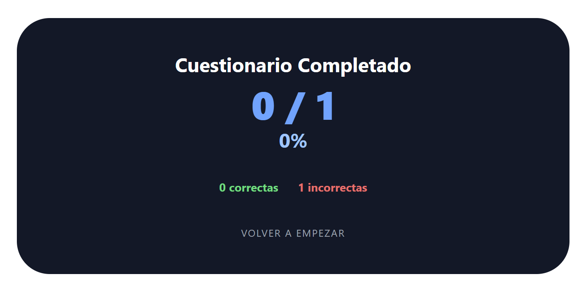 |

## Miscelánea

| Componente | Descripción | Imagen |
| --- | --- | --- |
| [DraftCard](../../edutech/frontend/src/components/DraftCard.tsx) | Representa un borrador guardado |  |
| [SuccessToast](../../edutech/frontend/src/components/SuccessToast.tsx) | Notificación que confirma que una operación se ha realizado con éxito |  |
