# Componentes

A continuación, se detallan todos los componentes implementados en el desarrollo de esta aplicación.

---

## Navegación y Layout

| Componente | Descripción | Imagen |
| --- | --- | --- |
| [Layout](../../edutech/frontend/src/components/Layout.tsx) | Estructura principal de la aplicación que envuelve el contenido con el header | 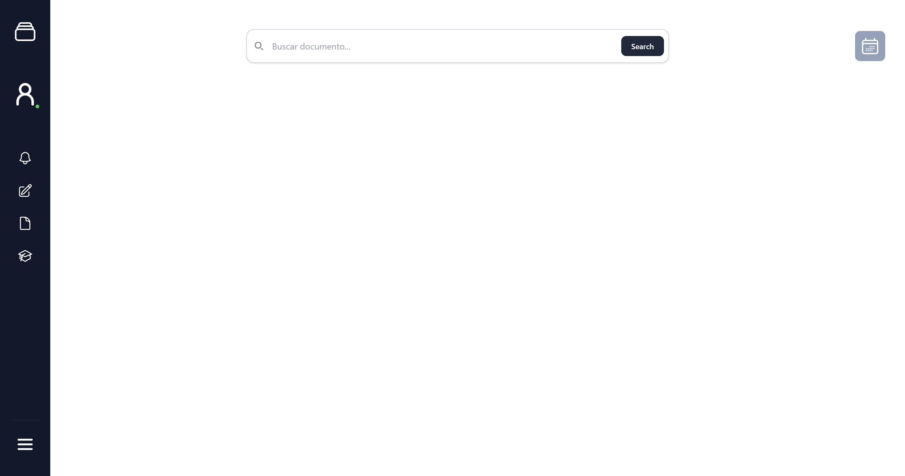 |
| [Header](../../edutech/frontend/src/components/Header.tsx) | Barra lateral de navegación con acceso al perfil y secciones principales |  |
| [HamburgerButton](../../edutech/frontend/src/components/HamburgerButton.tsx) | Botón para expandir o contraer el header |  |
| [TitlePage](../../edutech/frontend/src/components/TitlePage.tsx) | Cabecera de página con título y botón de retorno | 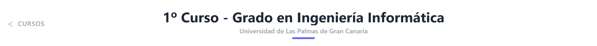 |

## Contenido

| Componente | Descripción | Imagen |
| --- | --- | --- |
| [PostCard](../../edutech/frontend/src/components/PostCard.tsx) | Tarjeta que representa un recurso individual mostrando su información básica |  |
| [PostGrid](../../edutech/frontend/src/components/PostGrid.tsx) | Layout que organiza múltiples tarjetas de recursos en formato responsive |  |
| [Preview](../../edutech/frontend/src/components/post-preview/preview.tsx) | Miniatura de una publicación según su tipo (PDF, vídeo, flashcard o cuestionario) | 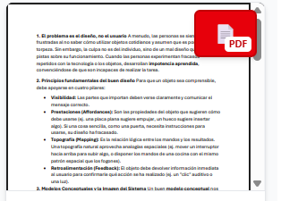 |
| [PostLabel](../../edutech/frontend/src/components/post-preview/labels.tsx) | Etiqueta que identifica el formato de una publicación | 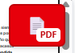 |
| [IAtag](../../edutech/frontend/src/components/IAtag.tsx) | Etiqueta visual que indica que un recurso ha sido generado o procesado por IA | 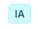 |

## Cursos y Asignaturas

| Componente | Descripción | Imagen |
| --- | --- | --- |
| [YearWidget](../../edutech/frontend/src/components/YearWidget.tsx) | Widget que representa a un año académico | 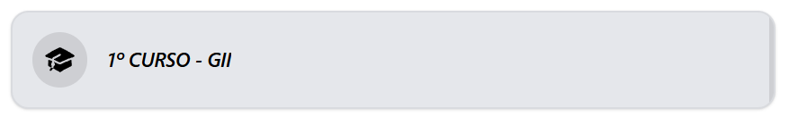
| [CourseWidget](../../edutech/frontend/src/components/CourseWidget.tsx) | Widget que representa a una asignatura y la suscripción asociada a ella | 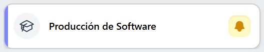 |
| [Quarter](../../edutech/frontend/src/components/Quarter.tsx) | Contenedor de asignaturas pertenecientes a un mismo cuatrimestre | 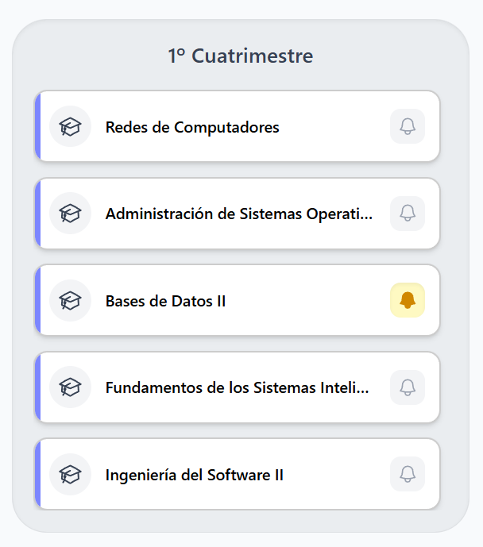 |
| [BellButton](../../edutech/frontend/src/components/interactions/BellButton.tsx) | Botón de suscripción o anulación de suscripción a una asignatura |  |

## Interacción y Feedback

| Componente | Descripción | Imagen |
| --- | --- | --- |
| [ReactionButton](../../edutech/frontend/src/components/interactions/ReactionButton.tsx) | Botón individual de like o dislike sobre un recurso |  |
| [ReactionsContainer](../../edutech/frontend/src/components/interactions/ReactionsContainer.tsx) | Contenedor que agrupa los botones de like y dislike con sus contadores |  |
| [Views](../../edutech/frontend/src/components/interactions/Views.tsx) | Contador de visualizaciones de un recurso |  |
| [Comment](../../edutech/frontend/src/components/interactions/Comment.tsx) | Representación de un comentario con autor, fecha y contenido | 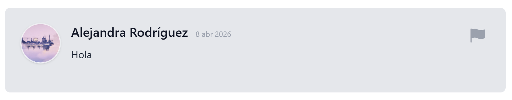 |
| [CommentModal](../../edutech/frontend/src/components/interactions/CommentModal.tsx) | Modal para añadir un nuevo comentario a un recurso o sesión de estudio |  |
| [CommentsSection](../../edutech/frontend/src/components/interactions/CommentsSection.tsx) | Sección que lista todos los comentarios asociados a un recurso |  |

## Formularios y Entrada de Datos

| Componente | Descripción | Imagen |
| --- | --- | --- |
| [Input](../../edutech/frontend/src/components/Input.tsx) | Campo personalizado para la entrada de datos |  |
| [SearchBar](../../edutech/frontend/src/components/SearchBar.tsx) | Barra de búsqueda de contenido |  |
| [Tabs](../../edutech/frontend/src/components/Tabs.tsx) | Filtro por tipo de contenido (PDF, vídeo, flashcard, cuestionario) | 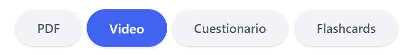 |

## Publicación de Contenido

| Componente | Descripción | Imagen |
| --- | --- | --- |
| [Footer](../../edutech/frontend/src/components/Footer.tsx) | Navegación inferior para publicar distintos tipos de material |  |
| [FormSteps](../../edutech/frontend/src/components/forms-components/FormSteps.tsx) | Estructura de formulario para publicar documentos PDF |  |
| [StageList](../../edutech/frontend/src/components/forms-components/StageList.tsx) | Listado de las etapas del formulario de publicación de PDF | 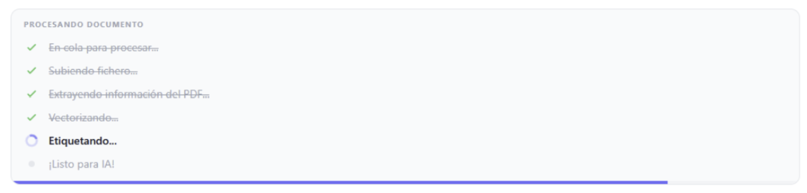 |
| [ProgressBar](../../edutech/frontend/src/components/forms-components/ProgressBar.tsx) | Barra de progreso para las tareas en la publicación de un PDF |  |
| [UploadDropzone](../../edutech/frontend/src/components/forms-components/UploadDropzone.tsx) | Zona para subir un PDF o imagen, previsualizándolo | 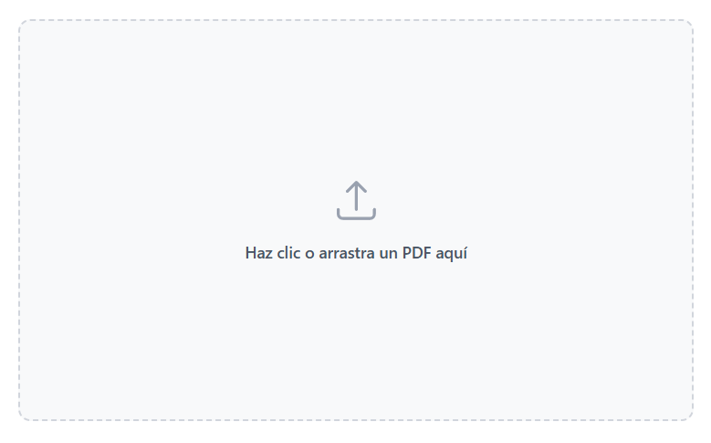 |
| [UrlPreview](../../edutech/frontend/src/components/forms-components/UrlPreview.tsx) | Vista previa del vídeo a partir de la URL introducida | 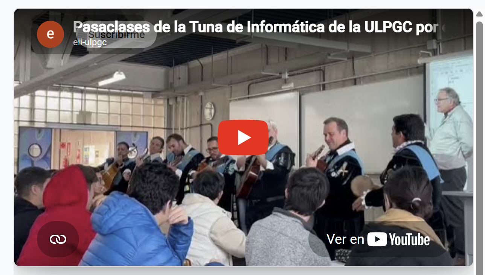 |
| [UploadMenuButton](../../edutech/frontend/src/components/UploadMenuButton.tsx) | Desplegable para seleccionar la publicación de un contenido | 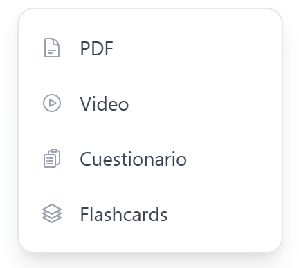 |

## Visualización de Contenido

| Componente | Descripción | Imagen |
| --- | --- | --- |
| [PDFViewer](../../edutech/frontend/src/components/PDFViewer.tsx) | Visor de documentos PDF |  |
| [VideoViewer](../../edutech/frontend/src/components/VideoViewer.tsx) | Reproductor de vídeos (embed de YouTube) |  |
| [DownloadButton](../../edutech/frontend/src/components/DownloadButton.tsx) | Botón para descargar un documento PDF |  |
| [DocumentInfo](../../edutech/frontend/src/components/DocumentInfo.tsx) | Panel con la información de un documento PDF |  |

## Usuario

| Componente | Descripción | Imagen |
| --- | --- | --- |
| [UserAvatar](../../edutech/frontend/src/components/UserAvatar.tsx) | Avatar del usuario con su imagen de perfil o un placeholder por defecto | 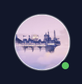 |
| [TwitchConnectButton](../../edutech/frontend/src/components/TwitchConnectButton.tsx) | Botón para iniciar el flujo OAuth de conexión con la cuenta de Twitch | 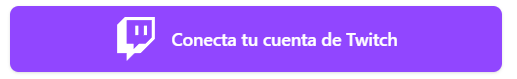 |

## Selección de Titulación

| Componente | Descripción | Imagen |
| --- | --- | --- |
| [SelectUniversity](../../edutech/frontend/src/components/degree-selection/SelectUniversity.tsx) | Desplegable para elegir la universidad del estudiante | 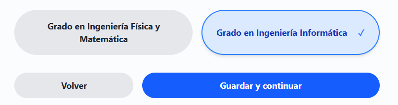 |
| [SelectionGrid](../../edutech/frontend/src/components/degree-selection/SelectionGrid.tsx) | Cuadrícula para seleccionar la carrera dentro de una universidad | 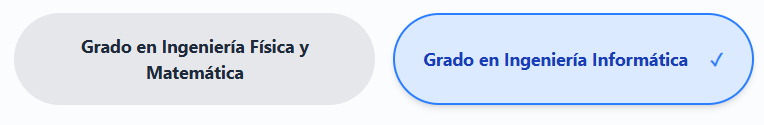 |
| [ButtonControl](../../edutech/frontend/src/components/degree-selection/ButtonControl.tsx) | Controles de navegación (atrás / guardar) del flujo de selección de titulación | 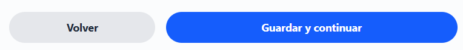 |

## Editor de Material de Estudio

| Componente | Descripción | Imagen |
| --- | --- | --- |
| [EditorLayout](../../edutech/frontend/src/components/study-material/EditorLayout.tsx) | Estructura principal del editor, gestiona el guardado automático y la navegación |  |
| [EditorHeader](../../edutech/frontend/src/components/study-material/EditorHeader.tsx) | Cabecera del editor con título editable y botones de guardar o publicar | 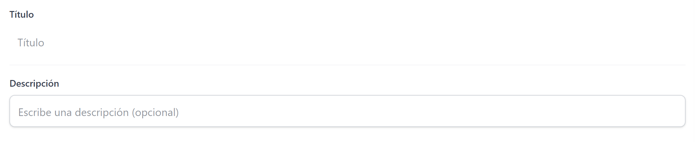 |
| [EditorSidebar](../../edutech/frontend/src/components/study-material/EditorSidebar.tsx) | Panel lateral del editor con el listado de _flashcards_ o preguntas creadas |  |
| [AddItemButton](../../edutech/frontend/src/components/study-material/AddItemButton.tsx) | Botón para añadir una nueva tarjeta o pregunta al formulario |  |
| [ConfirmModal](../../edutech/frontend/src/components/study-material/ConfirmModal.tsx) | Modal de confirmación para acciones destructivas |  |

## Flashcards

| Componente | Descripción | Imagen |
| --- | --- | --- |
| [FlashCardView](../../edutech/frontend/src/components/study-material/flashcards/FlashCardView.tsx) | Vista principal del modo de estudio de flashcards | 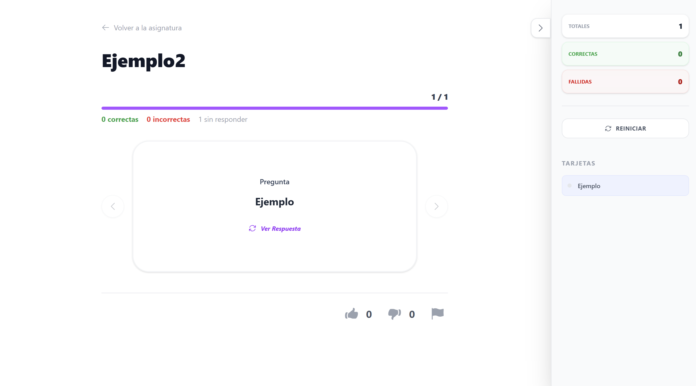 |
| [FlashCardItem](../../edutech/frontend/src/components/study-material/flashcards/FlashCardItem.tsx) | Tarjeta individual con pregunta y respuesta |  |
| [CardCarousel](../../edutech/frontend/src/components/study-material/flashcards/CardCarousel.tsx) | Carrusel para navegar entre las _flashcards_ del grupo | 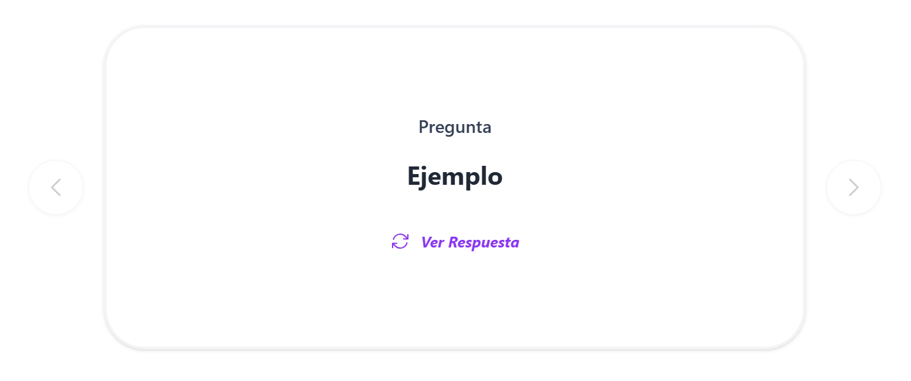 |

## Cuestionarios

Componentes utilizados en el modo de realización de cuestionarios.

| Componente | Descripción | Imagen |
| --- | --- | --- |
| [QuizCard](../../edutech/frontend/src/components/study-material/quiz/QuizCard.tsx) | Pregunta del cuestionario con sus respuestas |  |
| [QuizQuestion](../../edutech/frontend/src/components/study-material/quiz/QuizQuestion.tsx) | Enunciado de una pregunta del cuestionario |  |
| [QuizAnswer](../../edutech/frontend/src/components/study-material/quiz/QuizAnswer.tsx) | Respuesta seleccionable con indicador de acierto o error | 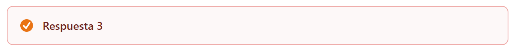 |

## Estudio

| Componente | Descripción | Imagen |
| --- | --- | --- |
| [StudyHeader](../../edutech/frontend/src/components/study-material/StudyHeader.tsx) | Cabecera con botón de retorno y título |  |
| [StudyProgressBar](../../edutech/frontend/src/components/study-material/StudyProgressBar.tsx) | Barra de progreso que indica cuántas tarjetas se han completado |  |
| [StudySidebar](../../edutech/frontend/src/components/study-material/StudySidebar.tsx) | Panel lateral con el índice de tarjetas o preguntas |  |
| [Stats](../../edutech/frontend/src/components/study-material/Stats.tsx) | Panel de resultados con el número de respuestas correctas e incorrectas |  |
| [CompletionBanner](../../edutech/frontend/src/components/study-material/CompletionBanner.tsx) | Resumen del resultado del estudio |  |

## Chatbot

| Componente | Descripción | Imagen |
| --- | --- | --- |
| [ChatbotWidget](../../edutech/frontend/src/components/chatbot/ChatbotWidget.tsx) | Interfaz completa del chatbot, integra cabecera, mensajes y campo de entrada | 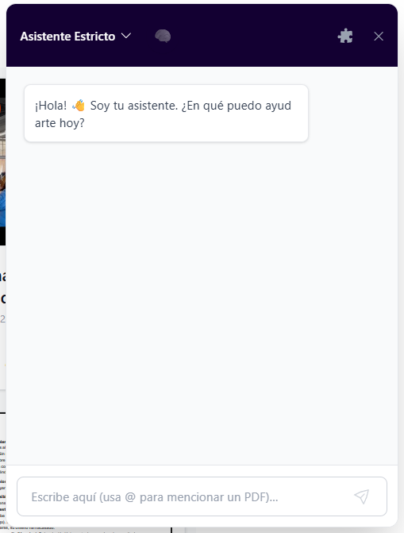 |
| [ChatbotHeader](../../edutech/frontend/src/components/chatbot/ChatbotHeader.tsx) | Cabecera del widget del chatbot con controles de modo (razonamiento profundo, herramientas) | 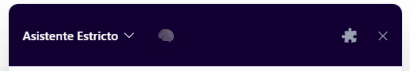 |
| [ChatbotMessageBox](../../edutech/frontend/src/components/chatbot/ChatbotMessageBox.tsx) | Contenedor que muestra el historial de la conversación con el chatbot | 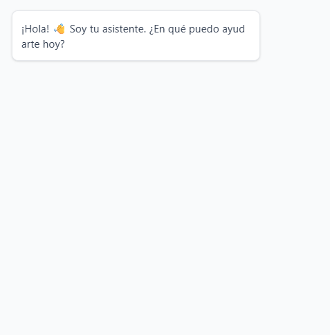 |
| [ChatbotMessage](../../edutech/frontend/src/components/chatbot/ChatbotMessage.tsx) | Burbuja individual de mensaje del chatbot o del usuario | 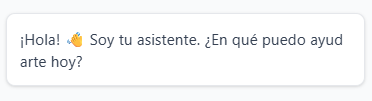 |
| [ChatbotFooterInput](../../edutech/frontend/src/components/chatbot/ChatbotFooterInput.tsx) | Campo de entrada para enviar consultas al chatbot | 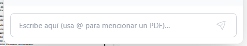 |
| [DocumentMentionList](../../edutech/frontend/src/components/chatbot/DocumentMentionList.tsx) | Lista de autocompletado para mencionar documentos dentro del chatbot | 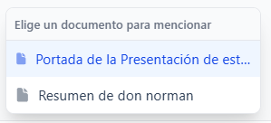 |

## Mi Espacio

Componentes del espacio personal del estudiante para organizar y guardar publicaciones en carpetas.

| Componente | Descripción | Imagen |
| --- | --- | --- |
| [SavedGrid](../../edutech/frontend/src/components/my-space/SavedGrid.tsx) | Cuadrícula que muestra las publicaciones guardadas por el usuario | 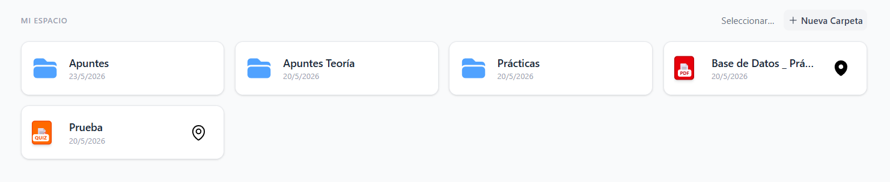 |
| [SavedPreview](../../edutech/frontend/src/components/my-space/SavedPreview.tsx) | Tarjeta de vista previa de una publicación guardada | 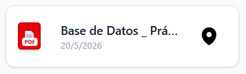 |
| [FolderCard](../../edutech/frontend/src/components/my-space/FolderCard.tsx) | Tarjeta que representa una carpeta con su nombre y acciones asociadas | 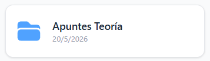 |
| [FolderSection](../../edutech/frontend/src/components/my-space/FolderSection.tsx) | Sección que lista las carpetas del usuario | 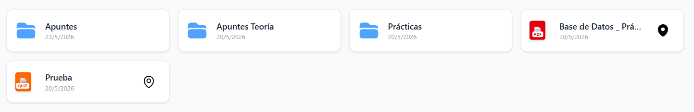 |
| [FolderPath](../../edutech/frontend/src/components/my-space/FolderPath.tsx) | Ruta de navegación dentro de las carpetas | 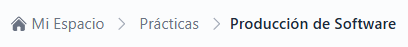 |
| [DroppablePath](../../edutech/frontend/src/components/my-space/DroppablePath.tsx) | Segmento de la ruta de carpeta que acepta elementos arrastrados para moverlos | 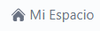 |
| [FolderInlineEditor](../../edutech/frontend/src/components/my-space/FolderInlineEditor.tsx) | Editor en línea para renombrar una carpeta directamente desde la tarjeta | 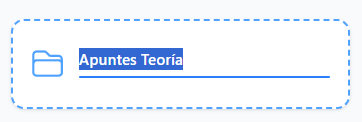 |
| [FolderEditorCell](../../edutech/frontend/src/components/my-space/FolderEditorCell.tsx) | Celda editable dentro del editor de carpetas | 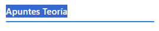 |
| [PinnedSection](../../edutech/frontend/src/components/my-space/PinnedSection.tsx) | Sección que muestra las publicaciones fijadas por el usuario | 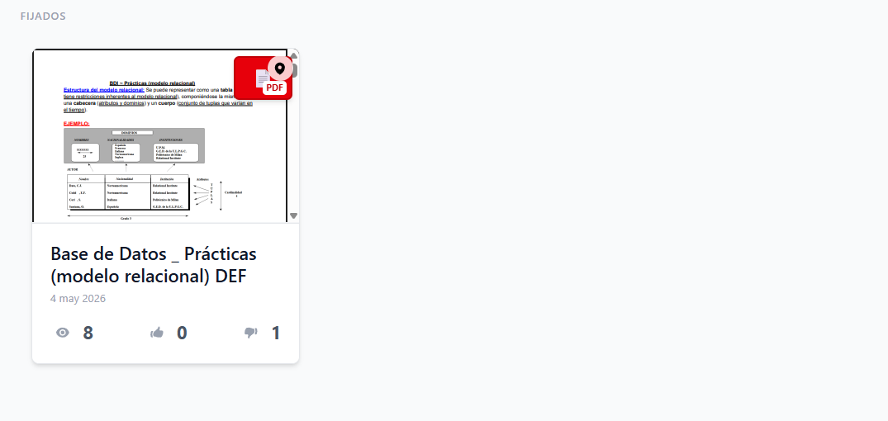 |
| [PinnedButton](../../edutech/frontend/src/components/my-space/PinnedButton.tsx) | Botón para fijar o desfijar una publicación guardada |  |
| [SaveButton](../../edutech/frontend/src/components/my-space/SaveButton.tsx) | Botón para guardar una publicación en una carpeta del espacio personal |  |
| [SectionTitle](../../edutech/frontend/src/components/my-space/SectionTitle.tsx) | Encabezado de sección con título y acciones opcionales | 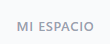 |
| [SelectionButtonsGroup](../../edutech/frontend/src/components/my-space/SelectionButtonsGroup.tsx) | Grupo de botones de acción masiva (mover, eliminar) en modo selección | 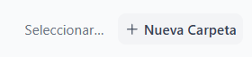 |
| [SelectionIndicator](../../edutech/frontend/src/components/my-space/SelectionIndicator.tsx) | Indicador visual de selección sobre una tarjeta de carpeta o publicación | 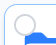 |
| [DeleteUndoToast](../../edutech/frontend/src/components/my-space/DeleteUndoToast.tsx) | Notificación con opción de deshacer la eliminación de un elemento | 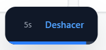 |

## Reportes

| Componente | Descripción | Imagen |
| --- | --- | --- |
| [ReportButton](../../edutech/frontend/src/components/reports/ReportButton.tsx) | Botón para iniciar el flujo de reporte de una publicación o comentario |  |
| [ReportPopup](../../edutech/frontend/src/components/reports/ReportPopup.tsx) | Modal para seleccionar el motivo y enviar un reporte | 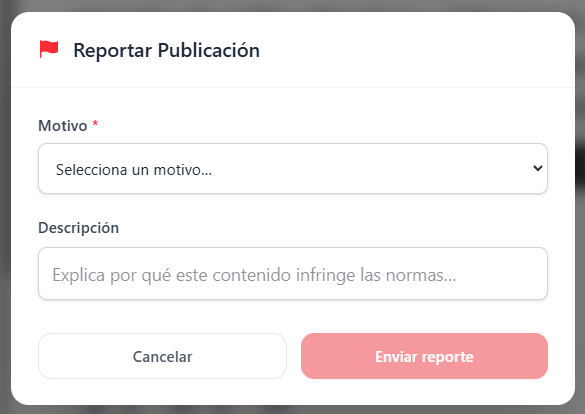 |
| [DocumentReport](../../edutech/frontend/src/components/reports/DocumentReport.tsx) | Tarjeta con el detalle de un reporte pendiente de revisión | 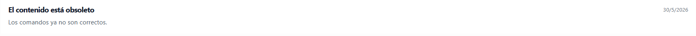 |
| [AdminWidget](../../edutech/frontend/src/components/reports/AdminWidget.tsx) | Widget de administrador con las acciones disponibles sobre un reporte | 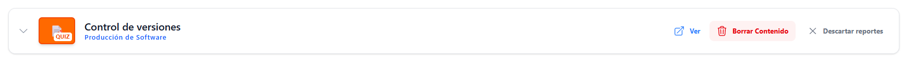 |
| [ActionButton](../../edutech/frontend/src/components/reports/ActionButton.tsx) | Botón de acción de administrador con paso de confirmación integrado | 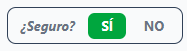 |

## Sesiones de Estudio

| Componente | Descripción | Imagen |
| --- | --- | --- |
| [SessionItem](../../edutech/frontend/src/components/study-sessions/SessionItem.tsx) | Elemento de lista que representa una sesión de estudio con sus datos principales | 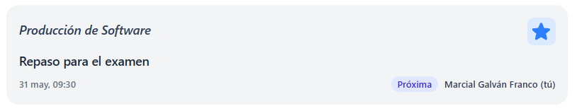 |
| [SessionHeader](../../edutech/frontend/src/components/study-sessions/SessionHeader.tsx) | Cabecera de la vista de detalle de una sesión de estudio | 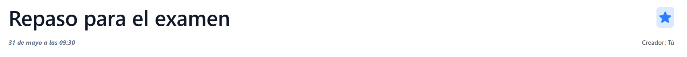 |
| [SessionDescription](../../edutech/frontend/src/components/study-sessions/SessionDescription.tsx) | Sección con la descripción completa de una sesión de estudio | 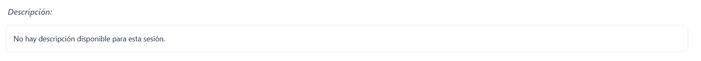 |
| [SessionStatusBadge](../../edutech/frontend/src/components/study-sessions/SessionStatusBadge.tsx) | Indicador de estado de una sesión (próxima, en curso, finalizada) | 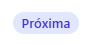 |
| [ParticipateButton](../../edutech/frontend/src/components/study-sessions/ParticipateButton.tsx) | Botón para unirse o abandonar una sesión de estudio |  |
| [CreateSessionModal](../../edutech/frontend/src/components/study-sessions/CreateSessionModal.tsx) | Modal para crear una nueva sesión de estudio con fecha, asignatura y descripción |  |
| [CalendarWidget](../../edutech/frontend/src/components/study-sessions/CalendarWidget.tsx) | Selector de fecha para filtrar sesiones de estudio |  |
| [SubjectDropdown](../../edutech/frontend/src/components/study-sessions/SubjectDropdown.tsx) | Desplegable para filtrar sesiones o seleccionar asignatura al crear una sesión |  |
| [StreamButton](../../edutech/frontend/src/components/study-sessions/StreamButton.tsx) | Botón para iniciar o detener la emisión en vivo de una sesión |  |
| [StreamPlayer](../../edutech/frontend/src/components/study-sessions/live/StreamPlayer.tsx) | Reproductor embebido del stream de Twitch activo en una sesión |  |
| [LiveChatPanel](../../edutech/frontend/src/components/study-sessions/live/LiveChatPanel.tsx) | Panel de chat en tiempo real para la comunicación durante la sesión en vivo |  |

## Miscelánea

| Componente | Descripción | Imagen |
| --- | --- | --- |
| [DraftCard](../../edutech/frontend/src/components/DraftCard.tsx) | Representa un borrador guardado |  |
| [SuccessToast](../../edutech/frontend/src/components/SuccessToast.tsx) | Notificación que confirma que una operación se ha realizado con éxito |  |
| [LoadInformation](../../edutech/frontend/src/components/LoadInformation.tsx) | Estado de carga que se muestra mientras se obtiene información del servidor |  |
