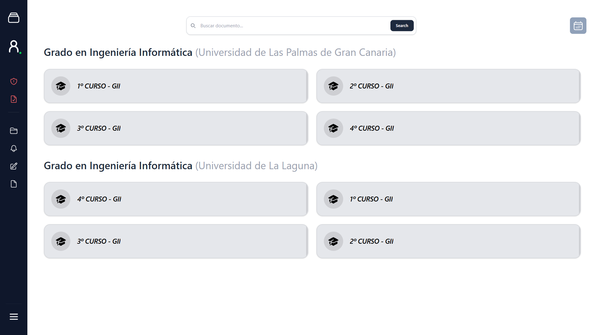

# EduTech – Sprint Dos

### Equipo _D-MACH_

### Marcial Galván - Houyame Liazidi - Alejandra Rodríguez - Cristina Santana - Dácil Santana



## Descripción del Proyecto

Este _sprint_ tiene como objetivo ampliar con el **minimo viable** (_MVP_) desarrollado en el _Sprint Uno_ de EduTech.

EduTech es una web que nace para resolver los siguientes problemas:

- **Dispersión del contenido académico**: Mantendremos el contenido organizado por cursos, asignaturas y cuatrimestres, facilitando la búsqueda del mismo.
- **Obsolescencia de material de estudio**: Se podrá reportar aquel contenido obsoleto o erróneo para que sea eliminado. De esta forma, se mantendrá un estándar mínimo de calidad y material actualizado.
- **Sobrecarga de información**: Se permitirá el filtrado del material por asignatura, título y tipo. Gracias a esto, los estudiantes podrán localizar el contenido de forma más eficiente.

---

## _Sprint Dos_

### Objetivos

El objetivo principal de este _sprint_ es consolidar y ampliar el _MVP_ ya existente, incorporando las siguientes funcionalidades:

- Mejoras en el perfil de usuario.
- Generación automática de material de estudio mediante IA.
- Sistema de revisión de contenido subido como medida de seguridad.
- Implementación de sesiones de estudio colaborativas con retransmisiones en tiempo real.

Tras la implementación de este _sprint_, el _MVP_ ha evolucionado hacia una herramienta más adaptativa, centrada en el usuario. No solo facilita el acceso al contenido, sino también su organización personalizada y la interacción entre estudiantes.

### Funcionalidades Incluidas

Durante este _sprint_ se han implementado las siguientes funcionalidades:

**Perfil Privado**

- Guardado de contenido en perfil privado.
- Organización del contenido guardado en carpetas.
- Fijar contenido guardado para un acceso más rápido.

**Creación Automática de Recursos de Estudio**

- Elaboración de cuestionarios y _flashcards_ desde el _chatbot_.
- Etiqueta IA para diferenciar el contenido generado por la inteligencia artificial.

**Estudio Colaborativo**

- Retransmisión en directo de sesiones de estudio.
- Chat en vivo durante sesiones de estudio.

**Revisión de Contenido**

- Análisis de PDFs subidos mediante IA.
- Revisión de un administrador en contenidos incorrectos analizados por la IA.

> [!NOTE]
> Para ello, se han desarrollado las siguientes historias de usuario del _product backlog_:
>
> - **HU-111a:** Modificar Contenido Guardado
> - **HU-111b:** Consultar Contenido Guardado
> - **HU-113a:** Creación de Carpetas Personales
> - **HU-113b:** Organización de Contenido en Carpetas
> - **HU-113c:** Eliminación de Carpetas Personales
> - **HU-114:** Fijar Contenido Guardado
> - **HU-205:** Consultas al Chatbot sobre un Documento
> - **HU-203:** Generación Automática de Cuestionarios
> - **HU-204:** Generación Automática de Tarjetas de Estudio
> - **HU-206:** Identificación de Contenido Generado por IA
> - **HU-303:** Retransmisión en Directo de Sesiones de Estudio
> - **HU-304:** Chat en Vivo durante Sesiones de Estudio
> - **HU-315:** Visualización de Comentarios en Sesiones de Estudio
> - **HU-404:** Análisis de Documentos mediante IA
> - **HU-405:** Revisión de Contenido Pendiente
> - **HU-406:** Notificación del Resultado de Revisión de Contenido
---

## Estructura del Proyecto

```bash
edutech/
├── frontend/                # Aplicación frontend (React + Vite)
│   └── src/
│       ├── components/      # Componentes reutilizables
│       ├── pages/           # Vistas principales
│       ├── services/        # Lógica de API
│       └── ...
├── backend/                 # Lógica de backend (Django)
└── tests/
    ├── frontend/            # Mock server (db.json)
    └── backend/
        ├── unit/            # Tests de unidad del backend
        ├── integration/     # Tests de integración de las entidades del backend
        └── bdd/             # Tests de comportamiento (BDD + Gherkin) del backend
```

- [`components/`](../../edutech/frontend/src/components/): Elementos reutilizados a lo largo de toda la aplicación (y con posibilidad de reutilizarlos en el futuro).

- [`pages/`](../../edutech/frontend/src/pages): Vistas principales, a las que el usuario puede acceder y navegar.

- [`services/`](../../edutech/frontend/src/services): Interfaz entre el backend y los componentes del _frontend_.

> [!TIP]
> _Para más información acerca de la implementación realizada, pueden consultar la documentación
> específica de [componentes](./Components.md), [páginas](./Pages.md) y [servicios](./Services.md)_

---

## Integración Continua y Calidad del Código

El proyecto cuenta con un _pipeline_ de **CI/CD** configurado en [GitHub Actions](./.github/workflows/ci.yml) que se ejecuta automáticamente con cada _push_ a las ramas `main` y `develop`.
<br>
Los tests incluidos en este _pipeline_ han sido ampliados tras añadir nuevas funcionalidades en este nuevo _sprint_.

### Pasos del pipeline

**Análisis estático**

- Comprobación de formato con `ruff format`
- _Linting_ con `ruff check`
- Verificación de tipos estáticos con `mypy`

**Tests del backend**

- **Tests de unidad** — verifican el comportamiento individual de cada componente
- **Tests de integración** — comprueban la interacción entre las distintas entidades del backend
- **Tests BDD** — validan los flujos de usuario mediante escenarios escritos en _Gherkin_

> [!NOTE]
> El backend cuenta con cobertura de tests de estos tres tipos. Los tests se encuentran en [`tests/backend/`](../../edutech/tests/backend/), organizados en las carpetas `unit/`, `integration/` y `bdd/`.

---

## Ejecución del proyecto

Estos son los comandos a ejecutar para lanzar el proyecto. Nótese que cada serie de comandos ha sido ejecutada desde la carpeta `Edutech/`.

1. Instalar dependencias:

```bash
# En frontend
cd edutech/frontend
npm install
npm install react-router-dom react react-dom
```

```bash
# En backend
cd ..
pip install -r ./backend/requirements.txt
```

2. Lanzar la aplicación


```bash
cd edutech/
python backend/manage.py migrate
docker compose -f docker-compose.local-yml up
```

---

## Tech Stack

<p align="center">
  
  
  
  
  
  
  
  
  
  
  
  
  
  
  
        
</p>
